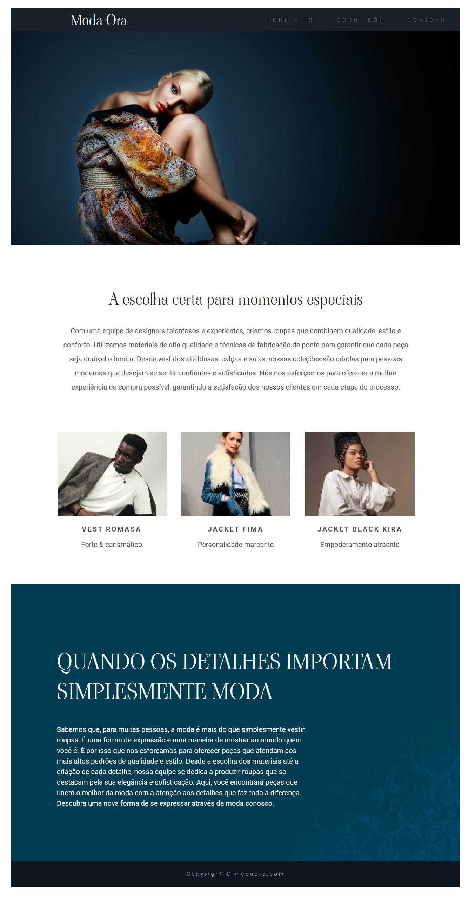

# Moda-Ora

**PROJETO DO CURSO DA UDEMY** [Serliv](https://www.udemy.com/course/curso-web-design-fundamentos-aprenda-html-css-e-javascript/)

Neste projeto trabalhei com importação de fonts e também tentei deixar o projeto responsivo.

O projeto final deveria ficar conforme a imagem abaixo: 
